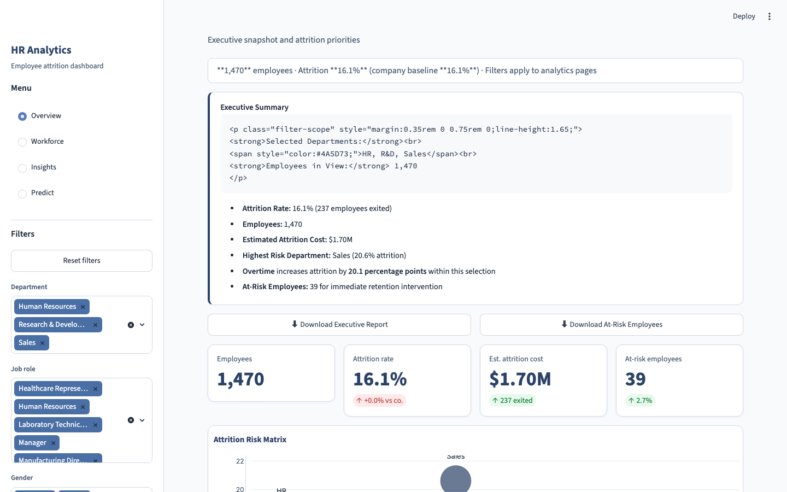
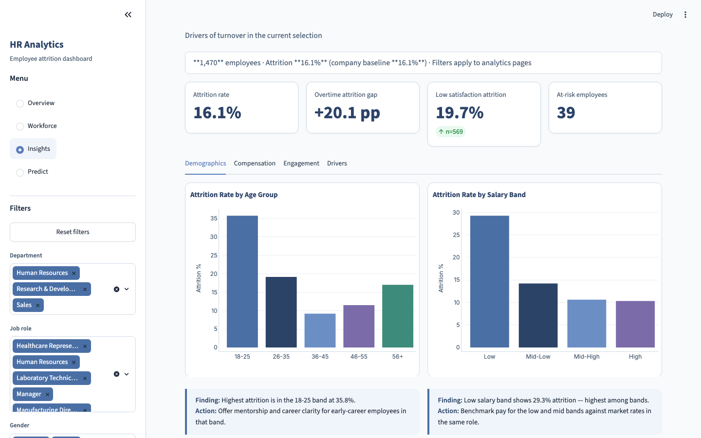
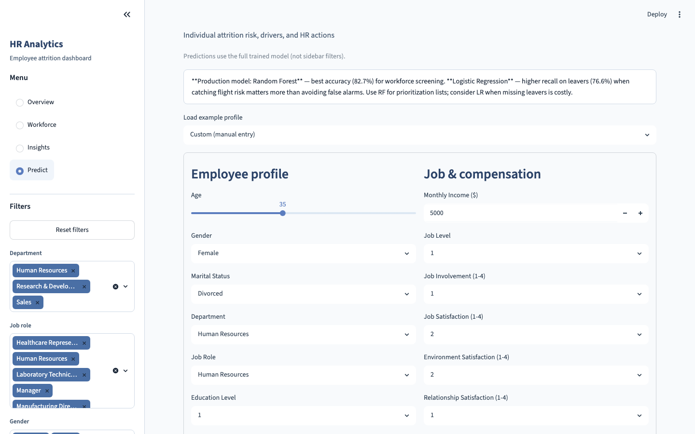

# HR Analytics Dashboard

**Author:** [Tharun Billuri](https://github.com/tharunbilluri)  
**Role:** Data Analyst portfolio project  
**Dataset:** [IBM HR Employee Attrition](https://www.kaggle.com/datasets/pavansubhasht/ibm-hr-analytics-attrition-dataset) (1,470 employees)

[](https://YOUR_APP_URL.streamlit.app)
[](https://www.loom.com/share/YOUR_LOOM_ID)

> **Replace badges above** after deploy: paste your Streamlit URL and Loom link (see [`docs/DEPLOY_STREAMLIT.md`](docs/DEPLOY_STREAMLIT.md) and [`docs/LOOM_WALKTHROUGH.md`](docs/LOOM_WALKTHROUGH.md)).

---

## Business problem

Employee turnover hurts productivity and increases hiring cost. This project answers:

1. **Where** is attrition highest (department, role, overtime)?
2. **Who** should HR contact first (at-risk cohort)?
3. **Will** a specific employee leave (ML prediction + recommendations)?

---

## Key results

**Executive summary**

- Attrition rate: **16.1%** (237 employees exited)
- Estimated attrition cost: **$1.70M**
- Highest risk department: **Sales** (20.6% attrition)
- Overtime increases attrition by **20.1 percentage points**
- **39 employees** identified for immediate retention intervention

**Top priorities:** (1) Reduce overtime exposure · (2) Sales retention initiative · (3) Stay interviews for at-risk cohort within 14 days

Full brief: [`docs/EXECUTIVE_SUMMARY.md`](docs/EXECUTIVE_SUMMARY.md) · Detailed report: [`docs/DETAILED_REPORT.md`](docs/DETAILED_REPORT.md)

---

## Dashboard preview

| Overview | Insights | Predict |
|:--------:|:--------:|:-------:|
|  |  |  |

| Page | Purpose |
|------|---------|
| **Overview** | Filter-aware executive summary, KPIs, risk matrix, downloads, at-risk worklist |
| **Workforce** | Salary, education, department risk table + CSV |
| **Insights** | Demographics, compensation, engagement, ML drivers (tabs) |
| **Predict** | Attrition probability, risk tier, drivers, HR recommendations |

---

## Live demo & video

| Resource | Link |
|----------|------|
| **Streamlit app** | `https://YOUR_APP_URL.streamlit.app` ← add after [deploy](docs/DEPLOY_STREAMLIT.md) |
| **2-min walkthrough** | `https://www.loom.com/share/YOUR_LOOM_ID` ← script: [`docs/LOOM_WALKTHROUGH.md`](docs/LOOM_WALKTHROUGH.md) |

---

## Approach

```
CSV → Preprocess → Train (LR + RF) → Streamlit dashboard
         ↓              ↓
      SQL scripts    model_metrics.json
```

- **Filter-aware insights** — Finding + Action text updates with sidebar filters  
- **Rule-based at-risk** — Overtime + low satisfaction + tenure &lt; 3 years  
- **ML prediction** — Random Forest (production), Logistic Regression (comparison)

Decision log: [`docs/DECISIONS.md`](docs/DECISIONS.md) · Interview prep: [`docs/INTERVIEW_NOTES.md`](docs/INTERVIEW_NOTES.md)

---

## Project structure

```
hr_analytics_project/
├── streamlit_app.py        # Cloud entrypoint (root)
├── app/
│   ├── streamlit_app.py    # 4-page dashboard
│   ├── analytics.py        # Insights, risk, executive logic
│   ├── utils.py            # Charts & KPIs
│   └── theme.py            # UI theme
├── src/
│   ├── preprocessing.py
│   ├── train_model.py
│   └── predict.py
├── sql/                    # MySQL / PostgreSQL scripts
├── notebooks/eda_analysis.ipynb
├── models/                 # Trained artifacts
├── docs/
│   ├── images/             # README screenshots
│   ├── EXECUTIVE_SUMMARY.md
│   ├── DEPLOY_STREAMLIT.md
│   └── LOOM_WALKTHROUGH.md
├── scripts/
│   ├── capture_screenshots.py
│   └── generate_docs.py
├── data/
├── main.py
└── requirements.txt
```

---

## Quick start

```bash
cd hr_analytics_project
python3 -m venv .venv && source .venv/bin/activate
pip install -r requirements.txt

python main.py --step preprocess
python main.py --step train
streamlit run streamlit_app.py
```

Open **http://localhost:8501**

Regenerate executive docs:

```bash
python scripts/generate_docs.py
```

Refresh README screenshots (app must be running on :8501):

```bash
pip install playwright && playwright install chromium
python scripts/capture_screenshots.py
```

---

## SQL analysis

Scripts in `sql/` — sample results (full company):

See [`docs/SQL_RESULTS.md`](docs/SQL_RESULTS.md) or run scripts after loading CSV into `employees` table (`sql/01_schema.sql`).

| Department | Attrition % |
|------------|-------------|
| Sales | 20.6% |
| Human Resources | 19.0% |
| Research & Development | 13.8% |

| Overtime | Attrition % |
|----------|-------------|
| Yes | 30.5% |
| No | 10.4% |

---

## Machine learning

| Model | Accuracy | Recall (leavers) | Best for |
|-------|----------|------------------|----------|
| Logistic Regression | 75.2% | **76.6%** | Catching flight risk |
| **Random Forest** | **82.7%** | 25.5% | **Production screening** |

Artifacts: `models/random_forest.joblib`, `models/model_metrics.json`, `models/feature_importance.csv`

**Top drivers:** Monthly income, Age, Total working years, Overtime, Years at company

---

## Tech stack

Python · Pandas · NumPy · Scikit-learn · Plotly · Streamlit · SQL · Jupyter

---

## License

IBM synthetic HR data (see Kaggle). Code for portfolio and learning use.
